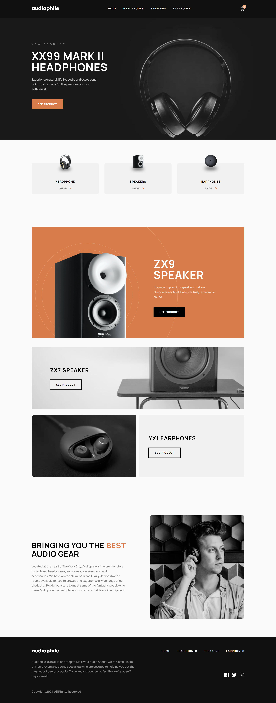

# Work In Process

This project is currently under development. The mobile screen layout is almost complete, and users can now view many features such as product details, cart functionality, and checkout options on mobile devices. Further improvements and features are still being added.

## Table of contents

- [The challenge](#the-challenge)
- [Screenshot](#screenshot)
- [Links](#links)
- [Features](#Features)
- [Installation](#Installation)
- [My process](#my-process)
  - [Built with](#built-with)
  - [Continued development](#continued-development)
  - [Useful resources](#useful-resources)
- [Author](#author)
- [Acknowledgments](#acknowledgments)

## Overview

### The challenge

Users should be able to:

- View the optimal layout for the app depending on their device's screen size
- See hover states for all interactive elements on the page
- Add/Remove products from the cart
- Edit product quantities in the cart
- Fill in all fields in the checkout
- Receive form validations if fields are missed or incorrect during checkout
- See correct checkout totals depending on the products in the cart
  - Shipping always adds $50 to the order
  - VAT is calculated as 20% of the product total, excluding shipping
- See an order confirmation modal after checking out with an order summary
- **Bonus**: Keep track of what's in the cart, even after refreshing the browser (`localStorage` could be used for this if you're not building out a full-stack app)

### Screenshot



### Links

- Solution URL: [Solution URL](https://github.com/nishanth1596/audiophile-ecommerce-website)
- Live Site URL: [Live site URL](https://nishanth-audiophile-ecommerce-website.netlify.app/)

### Features

- **Responsive Design**: The card layout adapts seamlessly from mobile to desktop view.
- **Dynamic Content**: Components are reusable, making it easy to extend the functionality or update the content.

### Installation

To run this project locally:

1. Clone this repository:

   ```bash
   git clone  https://github.com/nishanth1596/audiophile-ecommerce-website
   ```

2. Navigate into the project directory:
   cd audiophile-ecommerce-website

3. Install dependencies:
   npm install

4. Start the development server:
   npm run dev

5. Open the project in your browser at http://localhost:5173

## My process

### Built with

- Semantic HTML5 markup
- Tailwind CSS
- Flexbox
- Grid
- Mobile-first workflow
- Typescript
- [React](https://reactjs.org/) - JS library
- React redux toolkit
- React query

### What I learned

This project helped me become more comfortable with TypeScript, Tailwind CSS, and its utility-first approach to styling. It also deepened my understanding of Flexbox and Grid layout techniques.

### Continued development

I would like to continue practicing more complex layout techniques, especially working with Flexbox and Grid, and further improve my TypeScript skills.

### Useful resources

MDN Web Docs - Flexbox & Grid - This documentation helped me understand Flexbox better.
Tailwind CSS Documentation
Google Fonts - I used the Rubik fonts from Google Fonts to style the text.

### Author

- Name: Nishanth
- Website - [My GitHub Profile](https://github.com/nishanth1596)
- Frontend Mentor - [@nishanth1596](https://www.frontendmentor.io/profile/nishanth1596)
- Twitter - [@nishanth1596](https://x.com/nishanth1596)
